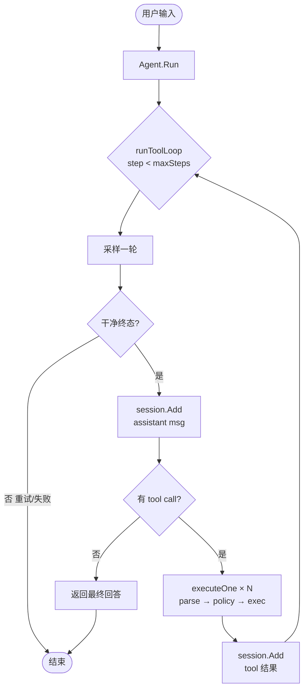

# Coding-Agent 现状与展望


## 整体结构

主流的Coding Agent(`codex, opencode, reasonix, zed`等)都是
- 基于ReAct范式的变体
- 以Agent loop为框架
- 以工具调用为核心的

基本流程都可以简化为:


而一次Turn是包含了核心为 `LLM请求、工具调用` 的loop，一次Turn也可以理解为一个`AgentTask`。

下面是一个简化的完整的Turn：


- 其中`采样一轮`是为了拼接上下文、恢复异常中断等。

真实的流程会稍微复杂点。比如会在每次loop时，判断
- 要不要压缩
- 为llm添加MCP、skill的描述
- 防注入安全校验
- 丰富的内置工具、沙箱机制等。

## agent差异

不同的agent有的是为自家模型量身定制的武器，有的则是为了探索新模式。

### reasonix

前面说了主流的agent都是ReAct的变体，reasonix的变在于添加了Plan-and-Execute`双模型Coordinator`架构、添加了工程性的鲁棒机制等。

- 在处理input前，默认进行路由决策，判断哪些turn需要plan; 不像其他agent，plan是用户手动触发的。

- `Loop guards`，在工程上对一些异常情况做处理，防止流程风暴。

- 新增了PrefixShape的逻辑，每一次loop前先判断本次会话的shape或者说指纹(`prompt + tools + memory`)，让用户能观察到一次请求是否真的命中缓存，揭示了服务端的cache逻辑。

- 多种死循环护栏`perTurnState`, 比如工具调用出现循环的失败或成功，会重新组织可见工具和prompt给模型重新评估。

- `Evidence ledger`,每一次turn都记账，只有实际处理和LLM返回相匹配时才退出，避免被LLM带歪，导致实际任务失败。

- YOLO功能，直接自动允许所有操作，不用再每次授权：不用考虑安全、绝对效率优先。

### codex

 codex的orchestrator有很大区别，
 
 - 工具执行的流水线固定为： 审批 → 沙箱选择 → 执行 → 失败降级重试

### Zed

Zed的创新在于用ACP把Agent这一层抽象出来，可以让用户快速切换agent，它自己则专注于快速处理和用户的交互。
实际测下来会有些小bug，比如某些工具在处理任务时一直会失败，实际上切换agent作用也不大，自家马配自家鞍才是最优解。

### tools 对比

如果大脑（模型）一样、方法论（agent loop）一样，指导方针（prompt）一样，那还有什么能拉开agent间的差距呢？答案是tools，tools是agent的武器，更是利器。

而差距的提现不只是在于某种工具有没有，而是在于如何使用，比如工具编排、验证和自动重试机制、甚至是失败后重新规划整个流程。

reasonix和codex的工具体系完全不一样，在解决实际coding任务时，效果很接近。

reasonix定义了一个个具体职责的工具：读写编辑等文件操作工具、ls blob grep web_fetch等检索工具、bash confine等shell工具、沙箱工具等。

而codex则是更抽象，没有按职责分那么细，只是定义出shell工具、cmd工具、mcp工具等，这和自家模型擅长处理的事件类型也有关系。例如，如果需要ls工具，模型会输出
```shell
{"name": "exec_command","cmd": "ls"}
```

## 总结
